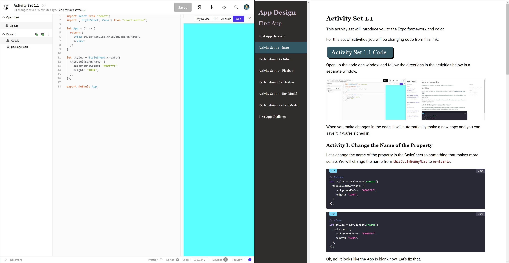

# Activity Set 1.1

This activity set will introduce you to the Expo framework and color.

For this set of activities you will be changing code
from this link:

<a href='https://snack.expo.io/@jeremyjgyoung/activity-set-1.1' target='_blank' class="mdxLink">
    Activity Set 1.1 Code
</a>


## How to Work Through Activities

Open up the code in one tab and follow the activity directions in a separate tab.


If you have a large screen you can open the code and directions up side by side.



When you make changes in the code, it will automatically make a new copy and you can save it if you're signed in.

## Activity I: Change the Name of the Property

Let's change the name of the property in the StyleSheet to something that makes more sense.
We will change the name from *thisCouldBeAnyName* to *container*.

```jsx
// Before
let styles = StyleSheet.create({
  thisCouldBeAnyName: {
    backgroundColor: "#00ffff",
    height: "100%",
  },
});
```

```jsx
// After
let styles = StyleSheet.create({
  container: {
    backgroundColor: "#00ffff",
    height: "100%",
  },
});
```

Oh, no! It looks like the App is blank now. Let's fix that.

## Activity II: Change the Reference to the Property

We can fix our code by re-naming the reference to the same exact name.

```jsx
// Before
let App = () => {
  return <View style={styles.thisCouldBeAnyName}></View>;
};
```

```jsx
// After
let App = () => {
  return <View style={styles.container}></View>;
};
```

Great! Now we have a name that makes more sense and an app that is working.

## Activity III: Change the Color

Let's change the backgroundColor to **"#ff0000"**.

Predict how this will change the app.

```jsx
// Before
let styles = StyleSheet.create({
  container: {
    backgroundColor: "#00ffff",
    height: "100%",
  },
});
```

```jsx
// After
let styles = StyleSheet.create({
  container: {
    backgroundColor: "#ff0000",
    height: "100%",
  },
});
```

You can try making the background different colors.
A valid color will contain six digits of any combination of the numbers 0-9 and the letters a-f.

## Activity IV: Add the Border

Let's add two properties, a **borderWidth** of **"10px"** and **borderColor** of **"#000000"**.
How do you think the app will look when you add these properties?

```jsx
// Before
let styles = StyleSheet.create({
  container: {
    backgroundColor: "#ff0000",
    height: "100%",
  },
});
```

```jsx
// After
let styles = StyleSheet.create({
  container: {
    backgroundColor: "#ff0000",
    height: "100%",
    borderWidth: "10px",
    borderColor: "#000000",
  },
});
```

Pay attention to the punctuation. Code won't work unless it has proper punctuation.
Try changing the color and number of pixels of width for the border to other values.

## Activity V: Change the Height

Change the **height** of the container to **50%**. Predict what you will see.

```jsx
// Before
let styles = StyleSheet.create({
  container: {
    backgroundColor: "#ff0000",
    height: "100%",
    borderWidth: "10px",
    borderColor: "#000000",
  },
});
```

```jsx
// After
let styles = StyleSheet.create({
  container: {
    backgroundColor: "#ff0000",
    height: "50%",
    borderWidth: "10px",
    borderColor: "#000000",
  },
});
```

Now delete the **height** property and add a **flex** of **1** to the container.

```jsx
// Before
let styles = StyleSheet.create({
  container: {
    backgroundColor: "#ff0000",
    height: "50%",
    borderWidth: "10px",
    borderColor: "#000000",
  },
});
```

```jsx
// After
let styles = StyleSheet.create({
  container: {
    backgroundColor: "#ff0000",
    flex: 1,
    borderWidth: "10px",
    borderColor: "#000000",
  },
});
```

There is typically an outer container of an app that takes up the entire width and height of the phone.

Now you should understand how to change the color, border, height of a box, and re-name a style property. Let's move onto to the explanation of this activity set.
