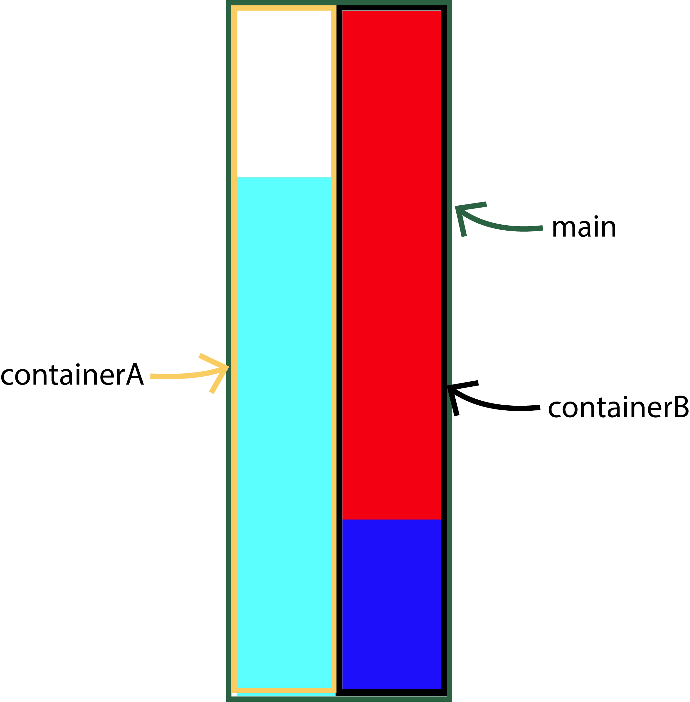

import FlexRatio from "../components-for-content/FlexRatio.jsx";

# Explanation of Activity Set Two

This will explain the concepts from the last activity set.

# Objects & the StyleSheet

Objects hold pairs of related data.

For example, here are two objects that represent users of an app.

```js
let userOne = {
  firstName: "Liam",
  lastName: "Miller",
  age: 23,
  loggedIn: true,
};

let userTwo = {
  firstName: "Olivia",
  lastName: "Kim",
  age: 67,
  loggedIn: false,
};
```

These users use the three main types of data: **numbers**, **strings** (text wrapped in strings), and **booleans** (the values true and false).

The value for a property can also be an object, as well. 
Here is an object that hold all of the users which are also objects. 
So we have objects embedded within an object.

```js
let appUsers = {
  userOne: {
    firstName: "Liam",
    lastName: "Miller",
    age: 23,
    loggedIn: true,
  },
  userTwo: {
    firstName: "Olivia",
    lastName: "Kim",
    age: 67,
    loggedIn: false,
  },
};
```

Take a moment to look at the syntax differences between having *userOne* and *userTwo* as separate objects versus being object embedded in a larger object, *appUsers*. 

Now when we look at the StyleSheet, we can notice it is an object with embedded objects for each separate style. 

```js
let styles = StyleSheet.create({
  main: {
    flexDirection: "row",
    flex: 1,
  },
  containerA: {
    flex: 1,
    flexDirection: "column",
  },
  containerB: {
    flex: 1,
    flexDirection: "column",
    borderColor: "#000000",
    borderWidth: "10px",
  },
  sectionA1: {
    flex: 1,
    backgroundColor: "#ffffff",
  },
  sectionA2: {
    flex: 3,
    backgroundColor: "#00ffff",
  },
  sectionB1: {
    flex: 3,
    backgroundColor: "#ff0000",
  },
  sectionB2: {
    flex: 1,
    backgroundColor: "#0000ff",
  },
});
```

In addition, the StyleSheet.create() code allows us to use the styles in other places.

# View Components Make the Layout

We use the View components to create a layout for our app.
Each View component you can think of as a rectangle.
To create the layout we want, we often have one rectangle wrapping other rectangles. 

```jsx
let App = () => {
  return (
    <View style={styles.main}>
      <View style={styles.containerA}>
        <View style={styles.sectionA1}>
        </View>
        <View style={styles.sectionA2}>
        </View>
      </View>
      <View style={styles.containerB}>
        <View style={styles.sectionB1}>
        </View>
        <View style={styles.sectionB2}>
        </View>
      </View>
    </View>
  );
};
```

For the Activity Set Two, we had the main View component wrapping everything and containerA and containerB as parents for two other View components.



# Flexbox

Flexbox allows us to place elements.

## View & Flexbox

The View rectangle wrapping the other components is called the parent
and the rectangles being wrapped are the children.

```jsx
export default function App() {
  return (
    <View style={styles.parent}>
      <View style={styles.childOne}></View>
      <View style={styles.childTwo}></View>
      <View style={styles.childThree}></View>
    </View>
  );
}
```

The parent decides on the direction of the children. The children have control over their flex number which affects how much space they take up.

## Flex Direction

Since Expo is used to build mobile apps the default direction set to column (since your phone is typically vertical).
You can change the flexDirection to row. The parent View component sets the flex direction for all its child View components.

## Flex Number

The flex number is a ratio for how much space an element takes up.
For instance, if there are two boxes in a flex container with a flex number of
2 and 3 - then the first box will take up two-fifths of the space and the other box will take up three-fifths of the space.

## Example with a Flex Direction & Number

Change the flex direction and number to see how it affects the boxes.

<FlexRatio />

<p>
You can try out your knowledge of the flex box by changing the flex direction and flex numbers for <a href="https://snack.expo.io/@jeremyjgyoung/flexbox-example" target="_blank">this example.</a>
</p>

# Onward!

Feel free to go to the home screen to check out more references or navigate back to the code to explore more.
Move onto the next activity set when you feel ready.