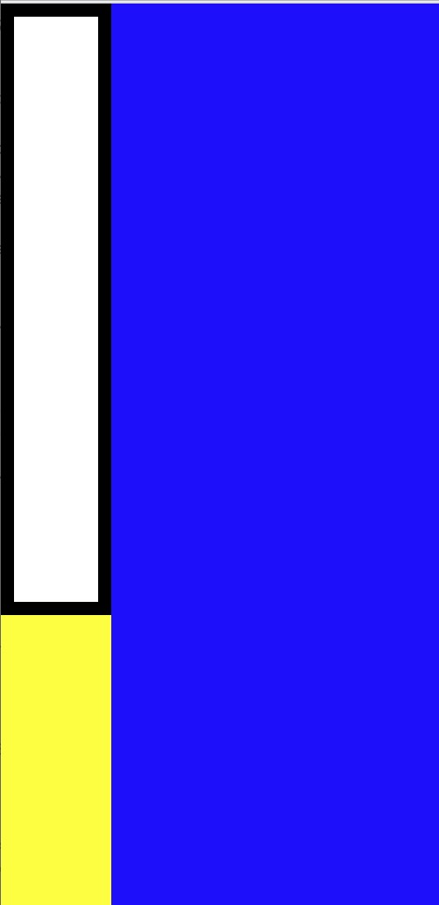

# First App Challenge

## Review

The topics for this section included how to work with color using hexadecimal values, flexbox which is a way of positioning elements, and the box model which is how to work with borders and space of a specific element.

## First App Challenge

Now you will build a Mondrian App based on Piet Mondrian's paintings.

You can try to replicate this particular piece exactly or make your own art that demonstrates your knowledge of color, flexbox, and the box model.

## First App Starter Code

Here is the starter code for this project:

<a href='https://snack.expo.io/@jeremyjgyoung/mondrian-starter' target='_blank' class="mdxLink">
    Mondrian Starter Code
</a>

Feel free to look at earlier activities and explanations to complete this task.

## Once You're Done

When you have completed the First App Challenge, move onto the Second App section.