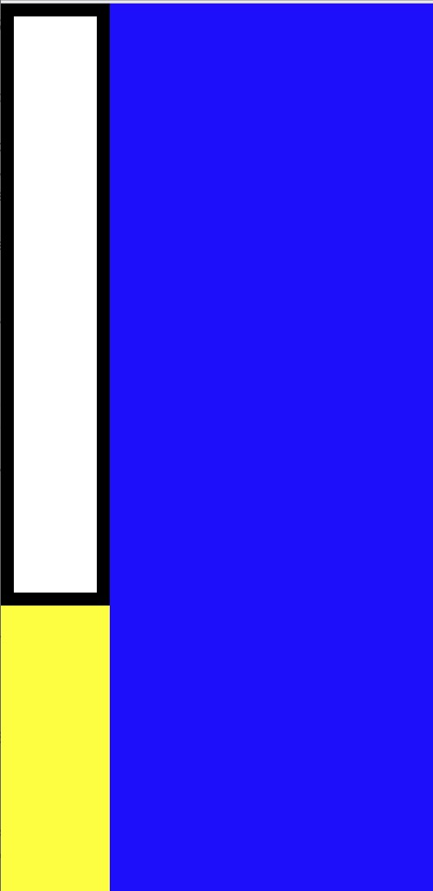

# First App Overview

## Topics

The topics for this section include how to work with color using hexadecimal values, flexbox which is a way of positioning elements, and the box model which is how to work with borders and space of a specific element.

## First App Challenge Preview

At the end of this section you will build a Mondrian App that will apply your knowledge of color, flexbox, and the box model.

## Activity Sets & Explanations

The activity sets include code to modify to gain an intuition for what the code does.
The explanations describe the concepts behind the activity sets.

Let's start activity set 1.1!