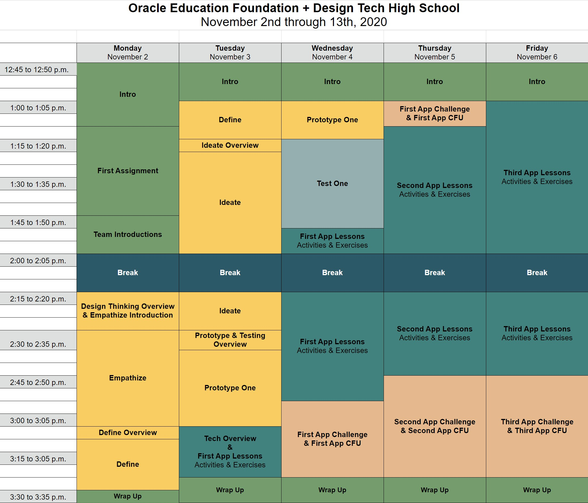

# Agenda

## Two-Week Agenda

**Week One**

The first two days of this course you will come up with a rough app idea based on a user. The next three days you learn basics of building apps.

Below is the link to the week one of our agenda:

<a href="https://docs.google.com/spreadsheets/d/e/2PACX-1vTXaY9I6gI8M0AazO0Y9Q27cXXltp5Fk7OBQhPJUw49di9am-dsrr7BwSkgoA_QPNZRJuS_4H0KUOs7/pubhtml?gid=221054578&single=true" target="_blank"  class="mdxLink">First Week Agenda</a>

**Week Two**

The second week you will create a prototype and presentation of your app that you will showcase on the last day.

Below is the link to the week one of our agenda:

<a href="https://docs.google.com/spreadsheets/d/e/2PACX-1vTXaY9I6gI8M0AazO0Y9Q27cXXltp5Fk7OBQhPJUw49di9am-dsrr7BwSkgoA_QPNZRJuS_4H0KUOs7/pubhtml?gid=165485536&single=true" target="_blank"  class="mdxLink">Second Week Agenda</a>

## Pacing Guide

The pacing guide has the same information as the two week agenda, but is easier to view on a daily basis.

Below is the link to the pacing guide:

<a href="https://docs.google.com/document/d/e/2PACX-1vTD8WbJVaE5KSMTM8lx0-lYZxZI8QBqpRnNYaE2007EiZ0Hmx9ni7KU7x1uKyLx1TeN6BZ1v7dXraQ9/pub" target="_blank"  class="mdxLink">Pacing Guide</a>