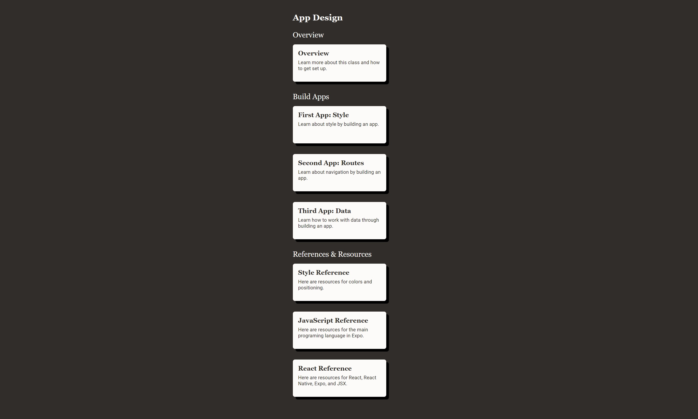

# About the Course

## Build Apps Sections

In the Build Apps sections you will learn through a series of activities, explanations, and challenges.
In the activity sections you will change code to build an intuition for what code affects what part of the app.
In the explanation lessons you gain an understanding of have the concepts you had exposure to through the activities.
At the end of each section you will have a challenge to build an app.

You will learn about the style of apps through the first app, about transitioning between screens in the second app, and about data in the third app.

## Reference & Resource Sections

These are more comprehensive lessons to go through if you need a more thorough explanation for a topic.
There are also links to more reference and tutorial material.
The reference sections will be most useful when you are building your own app.

## Getting the Most Out of the Course

You will get the most out of the course when you are actively engaged.
This means asking questions, exploring the code by making changes you are curious about, and taking time to make sense of the code.
