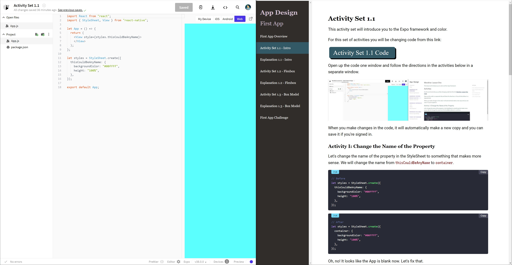

# About the Course

## Build Apps Sections

In the Build Apps you will learn through a series of activities, explanations, and challenges.
You will learn about the style of apps through the First App, about transitioning between screens in the second app, and about data in the third app.

In the activities section you will modify code based on the directions.
The ideal setup for smaller screens is to have two tabs you cycle between and for a larger screen to have the directions and code side-by-side.

In the explanation lessons, you gain an understanding of have the concepts you had exposure to through the activities.
At the end of each section, you will have a challenge to build an app.

## Reference & Resource Sections

The sections below the courses that teach you how to build the three apps are more resources to reference.
These are more comprehensive lessons to go through if you need a more thorough explanation for a topic.
The reference sections will be most useful when you are building your own app.

## Getting the Most Out of the Course

You will get the most out of the course when you are actively engaged.
This means asking questions, exploring the code by making changes you are curious about, and taking time to make sense of the code.
