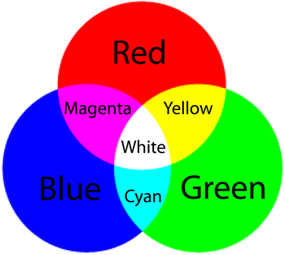

import ColorBox from "../../components-for-content/ColorBox.jsx";
import HexSlider from "../../components-for-content/HexSlider.jsx";
import ColorfulHexBox from "../../components-for-content/ColorfulHexBox.jsx";

## RGB

Every color you see on a phone, TV, or computer screen is made up of three tiny red, green, and blue pixels in close proximity.

Below is a Venn Diagram that shows the colors you will see if one, two, or three pixels are turned on at the same time.

## Hexadecimal Color System

To tell the computer how much to turn on the red, green and blue we use the hexadecimal system.
The hexadecimal system includes the numbers 0-9 and letters a-f.

This allows for 16 possibilities in one digit or 256 in two digits.

Move the slider below to how the hexadecimal system maps onto the more familiar base ten number system:

<HexSlider />

The hex code for colors uses six hexadecimal values.
Two values for red, green, and blue in that order.
The value 00 would be completely off for the pixel while ff would be completely on.

Scroll over the color buttons to see the hex code for each color:

<ColorBox />

The # sign is a common way to say we are using hexadecimal values. Note when the RGB values are all the same the color is neutral.
This is how we can use six digits to tell the computer how to create any color you can see on this screen!

Move the sliders to make the box change colors:

<ColorfulHexBox />

On <a href="https://htmlcolorcodes.com/" target="_blank">this website</a> you can see the hex code for more colors.

## A Color Palette

Designers create a color palette for their app.

Colors next to each other should contrast.
There are design expectations of neutral colors for text and backgrounds while having bright colors for buttons.

You can use <a href="https://coolors.co/" target="_blank">this color generator</a> to come up with a color palette.

## Color Example

You can change the backgroundColor in this example to deepen your understanding of hex codes: <a href="https://snack.expo.io/@jeremyjgyoung/color-example" target="_blank">Color Example</a>