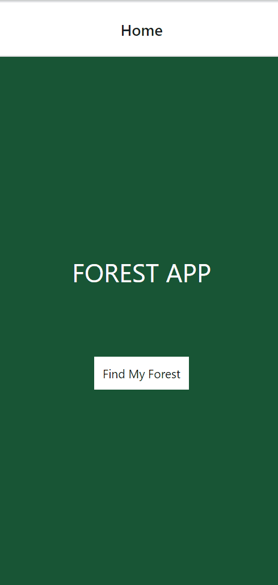

# Second App Overview

## Review

In this section you learned how to work with the TouchableOpacity and Image components, how to transition between screens, and how to debug your apps.

## Second App Challenge

For the second app you will create is a the Forest App.

You can try to replicate this particular app exactly or make your own app that demonstrates your using View, Text, Image, & TouchalbeOpacity components and navigation.

# Starter Code

Here is the starter code for the forest app: 

<a
    href="https://snack.expo.io/@jeremyjgyoung/the-forest-app-starter"
    target="_blank"
    class="mdxLink"
>
    Forest App Starter
</a>

Don't worry that the starter has errors.
Feel free to look back at the code from other lessons.

## Once You're Done

When you have completed the Second App Challenge, move onto the Third App section.
