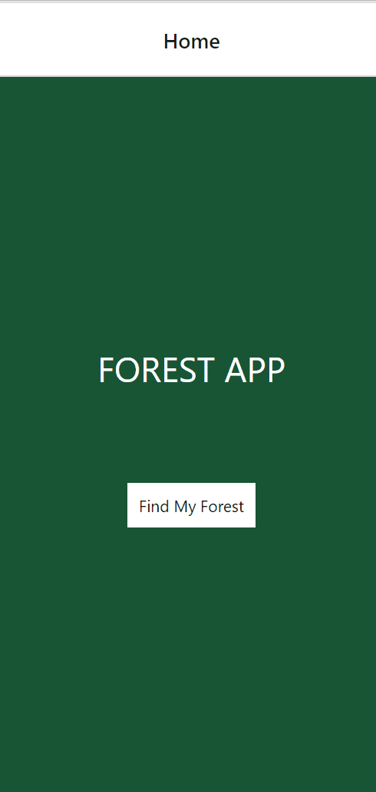

# Second App Overview

## Topics

The topics for this section include how to work with the TouchableOpacity and Image components, how to transition between screens, and how to debug your apps.

## Second App Challenge Preview

For the second app you will create is a the Forest App.
In order to make this app, you will need to learn how to build navigation within an app.

Let's start activity set one for our second app!
