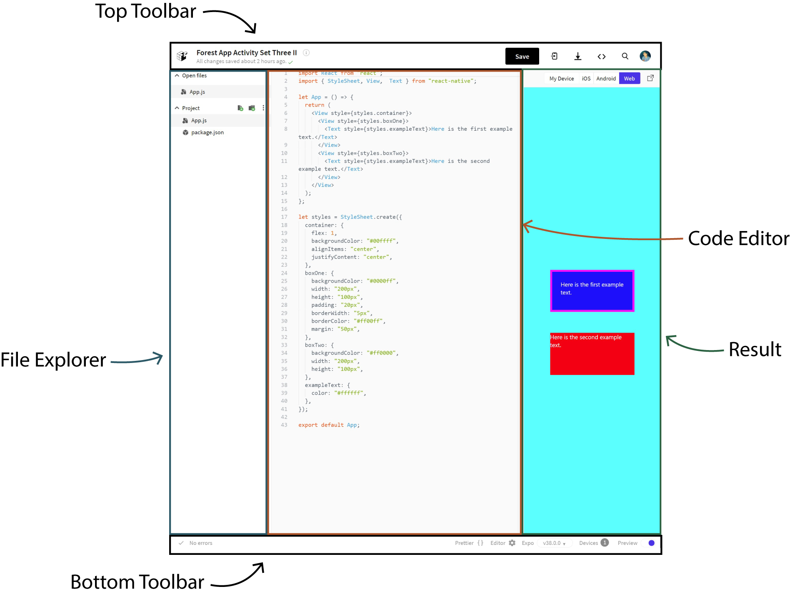

# IDE

An Integrated Development Environment (IDE) is a place to write and run code.
Expo has an online IDE where each project is called a snack.

The left side of the IDE is the file explorer where you see the files and folders of your project, the middle portion is where you write your code,
and the right side of the IDE is where you see the result of your code.

At the top of the IDE you have an area to change the name of the project, save the project, or access your account.
Near the bottom you can press Prettier to format your code and click on the left-hand side you can see the logs and problems with your app.

## Shortcuts

You can refer back to these shortcuts to program faster.

- Save with Ctrl + S
- Unindent with Shift + Tab
- Delete a line with Ctrl + K
- Select the next instance of a word with multiple cursors with Ctrl + D
- Toggle comments with Ctrl + /
