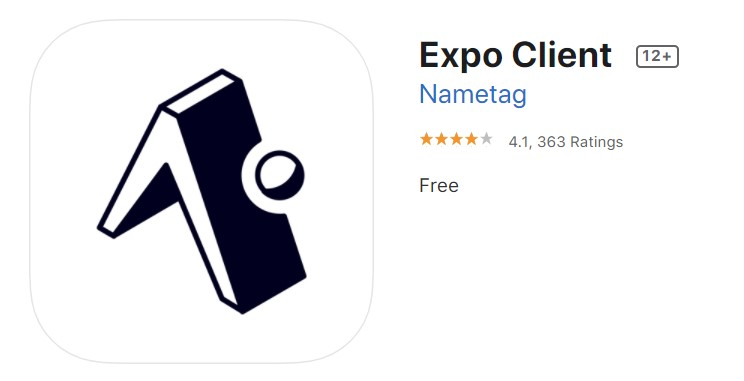

# Set Up

## Technology

For this course we will be using Expo. Expo is a technology built upon
React Native which allows you to build iOS and Android apps.

## Setup

Sign up for an account at: <a href="https://expo.io/signup" target="_blank" class="mdxLink">Expo Signup</a>

To test the apps on your phone download the Expo app.

Click NEXT to learn about the IDE we will be using.
