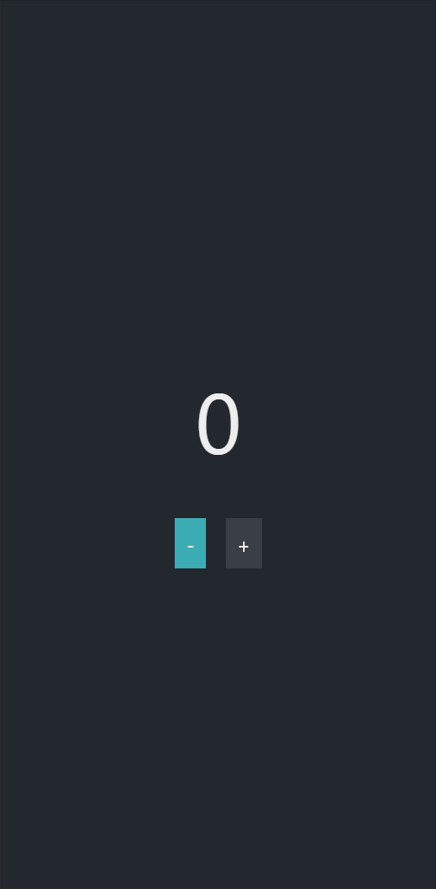

# Third App Challenge

## Review

The section included how to work with arrays and use data within your app

## Third App Challenge

Now you will create a counter app similar to the one below.

There should be a button that makes the count go up and a button that makes the count go down.

Feel free to build any app that has data that changes with user interaction.

# Starter Code

Here is the starter code for the counter app: 

<a
    href="https://snack.expo.io/@jeremyjgyoung/counter-app-starter"
    target="_blank"
    class="mdxLink"
>
    Counter App Starter
</a>

Feel free to look back at the code from other lessons.

## Once You're Done

When you have completed the Third App Challenge, now you should be able to build your own app with the assistance of the References & Resources section.